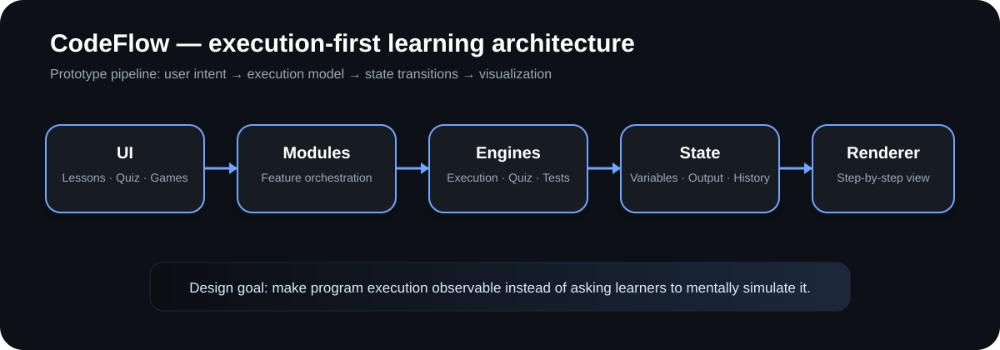

<p align="center">

</p>

<p align="center">
<a href="https://codeflow-app-sigma.vercel.app"></a>


</p>

# CodeFlow

**Execution-first programming learning and visualization prototype.**

CodeFlow explores a simple teaching hypothesis: beginners understand code better when they can **see execution evolve step by step** instead of only predicting final output.

> **Prototype:** the execution engine is intentionally limited and pattern-oriented. CodeFlow is not a general-purpose interpreter.

## What it demonstrates

- **Execution visualization** — variables, loops, and output across discrete steps.
- **Lessons** — structured programming concepts.
- **Quiz engine** — MCQs and output prediction.
- **Logic Quest** — gamified programming challenges.
- **AI chatbot** — experimental learning assistance.
- **Modular architecture** — UI, modules, engines, state, and rendering are separated.

## Execution model

```text
Code input
   ↓
Pattern-oriented parser
   ↓
Execution simulator
   ↓
State tracker
   ↓
Step generator
   ↓
Visualization renderer
```

Example:

```c
for (int i = 0; i < 3; i++)
    printf("%d", i);
```

The prototype turns this into observable transitions such as initialization → execution → increment → execution → exit, making state changes explicit.

## Engineering status

| Area | Status |
|---|---|
| Architecture | Modular prototype |
| Execution engine | Early / rule-based |
| Visualization | Functional |
| Testing | Basic CI validation |
| Build | GitHub Actions validated |
| Backend | Not currently required |

## Development

```bash
npm install
npm test
npm run build
npm run dev
```

CI runs tests and a production build on pushes and pull requests to `main`.

## Roadmap

- [ ] AST-backed intermediate representation for supported examples
- [ ] Stronger unit and browser-level tests
- [ ] More robust nested control-flow visualization
- [ ] Multi-language execution models
- [ ] Performance instrumentation for large lesson sets

## Repository structure

```text
src/
├── core/       # application core and routing
├── engines/    # visualization, quiz and self-test logic
├── modules/    # lessons, chatbot and game features
├── ui/         # rendering and layout
└── utils/      # shared helpers and storage

docs/           # architecture and project documentation
.github/        # CI workflow
```

## Contributing & security

See [`CONTRIBUTING.md`](CONTRIBUTING.md) and [`SECURITY.md`](SECURITY.md). Keep changes focused and preserve the educational prototype boundary.

## Live demo

**[Open CodeFlow](https://codeflow-app-sigma.vercel.app)**

## Author

Joel Jigo · B.Tech CSE

<p align="center"><sub>Built as an engineering and learning-system prototype.</sub></p>
